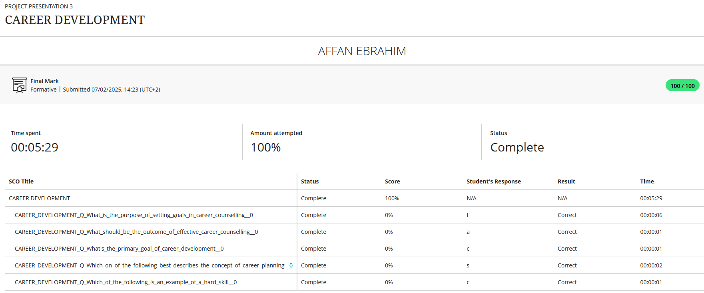
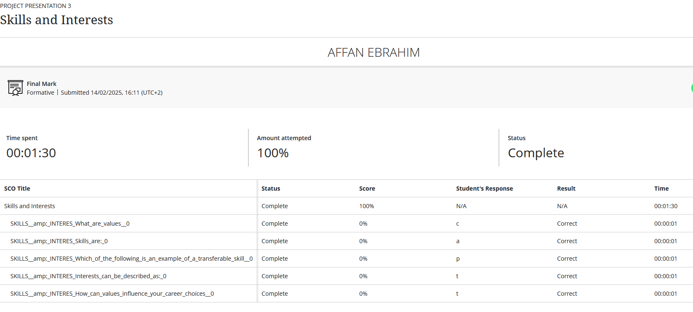
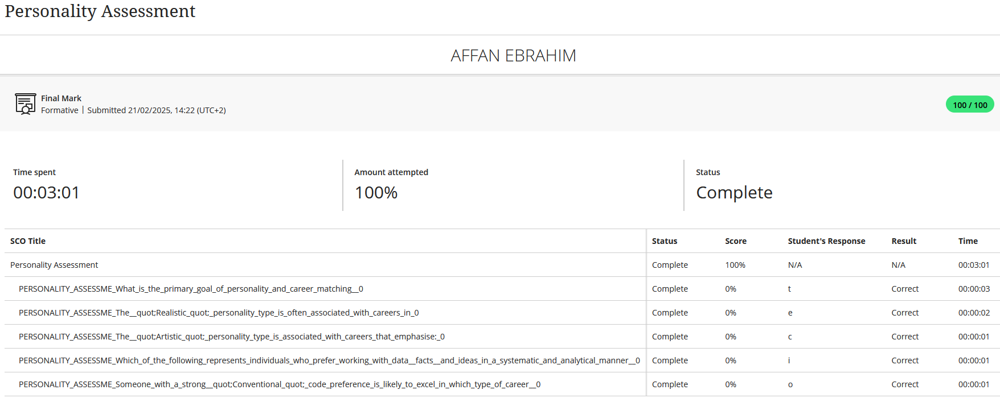
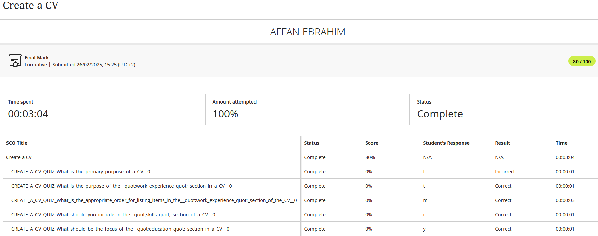
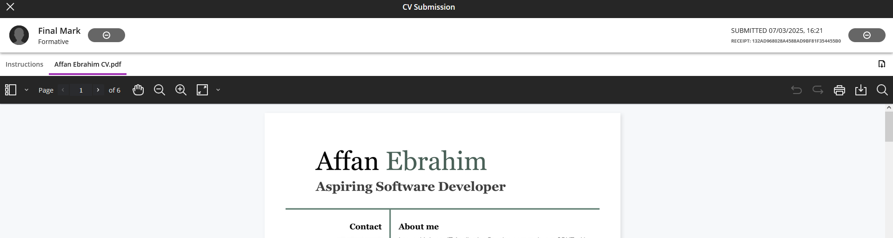

# Affan's Digital Portfolio

## Career Counselling
### Evidence

### Reflection (STAR)
**Situation**: I was uncertain about which direction to take after graduation.  
**Task**: I needed to clarify my interests and strengths.  
**Action**: Attended a counselling session.  
**Result**: It helped me consider  DevOps as future paths.

## Skills and Interest
### Evidence

### Reflection (STAR)
**Situation**: I needed to assess what I’m good at and what I enjoy.  
**Task**: Document my strengths and explore areas of interest.  
**Action**: Created a skills matrix and interest inventory.  
**Result**: I learned that I enjoy logic based problem solving and automation.

## Personality Assessment
### Evidence

### Reflection (STAR)
**Situation**: I wanted to understand how my personality fits in the tech industry.  
**Task**: Take a personality test and reflect on the results.  
**Action**: Completed an personality test and reviewed career suggestions.  
**Result**: It confirmed that I am analytical and enjoy structured environments.

## Create a CV
### Evidence

### Reflection (STAR)
**Situation**: I needed a professional CV for internship applications.  
**Task**: Create and format my CV.  
**Action**: Used a modern template and highlighted relevant experiences.  
**Result**: I have a  CV for job applications.

## CV Submission
### Evidence

### Reflection (STAR)
**Situation**: I had to begin applying for internships.  
**Task**: Submit my CV to job applications.  
**Action**: Registered on job sites and uploaded my CV.  
**Result**: I’ve started applying to real job opportunities.

## Business Communication
### Evidence

### Reflection (STAR)
**Situation**:  I had to write a formal email to a lecturer to request an extension for a project deadline.
**Task**:  My task was to communicate my request clearly and professionally, justifying my reason without making excuses, and to maintain a positive relationship with the lecturer.
**Action**: I used a clear subject line, a formal salutation, and a polite tone. I stated my request upfront, provided a concise and honest reason for the delay, acknowledged the inconvenience, and proposed a new submission date. I proofread the email for clarity and errors before sending.
**Result**: The lecturer replied promptly and granted the extension. They commended me for my professional communication. This resulted in less stress and a better final project submission.

## Interview Skills
### Evidence

### Reflection (STAR)
**Situation**:  I was preparing for a mock interview 
**Task**:  My task was to formulate a compelling answer that demonstrated my problem-solving abilities and resilience, using a real example from my academic projects.
**Action**: I selected a challenging group project where we faced a major coding bug. Using the STAR technique, I outlined the situation, my specific task to fix the bug, the actions I took like researching documentation and debugging step-by-step, and the final result. I practiced delivering this answer concisely and confidently.
**Result**: This preparation helped me structure my thoughts. During the practice interview, my answer was clear, focused, and effectively showcased my technical and soft skills, receiving positive feedback from the interviewer.

## Mock Interview
### Evidence

### Reflection (STAR)
**Situation**:  I participated in a recorded mock interview
**Task**:  My task was to present myself as a competent and confident candidate
**Action**: I dressed professionally, ensured my background was tidy, and tested my tech beforehand. I listened carefully to questions, paused to think before answering, and used the STAR method for behavioural questions. I also prepared thoughtful questions to ask the interviewer about the company culture.
**Result**: The feedback highlighted my strong technical knowledge but suggested I speak slower. Reviewing the recording, I noticed I used filler words when nervous. This was a valuable insight, and I am now practicing to speak more deliberately to appear more confident.

## Professional Networking
### Evidence

### Reflection (STAR)
**Situation**:  I had to look for internship oppurtunities so I had to network in order to find insghts
**Task**:  Make aan effort to message people in order to connect and put myself out there
**Action**: I made connections via LinkIn with alumni and I reached out to family and friends
**Result**: I gained connections which will help me in my career and I gained a lot of insight to how to bring value to others

## Workplace Etiquette
### Evidence

### Reflection (STAR)
**Situation**:  I was part of a cross-functional student project team with members from different backgrounds, and we had to collaborate entirely online to complete a major assignment.
**Task**:  My task was to contribute effectively while demonstrating respect, reliability, and professionalism in a virtual team setting
**Action**: I was always punctual for our online meetings and came prepared. I communicated proactively on our Teams channel if I was facing delays. I actively listened to teammates' ideas without interrupting, provided constructive feedback, and reliably completed my assigned tasks by the deadlines we set together.
**Result**: This fostered a trusting and collaborative environment. Our team dynamic was positive and efficient, which directly contributed to us submitting a high-quality project on time and receiving a distinction. I learned that strong workplace etiquette is crucial for team success.

